# Assignment 3

CS424 (Fall 2023) - Visualization & Visual Analytics

Group: The Tree Friends

### Introduction
The data is transformed additionally in our notebook. It was initially cleaned from the previous assignment. A copy of the file can be found [here](https://magical-milk-bucket.nyc3.digitaloceanspaces.com/Traffic%20Crashes%20(Modified).csv) This is done using Altair and VegaFusion in Jupyter Notebook. The file was too large to add to GitHub so we added it to [here](https://magical-milk-bucket.nyc3.digitaloceanspaces.com/Assignment%203.ipynb)

### Distribution of Work

- Tony Cao - Task 1 and README.md
- Sidney Mei - Task 2, Task 3
- Kevin Cheung - Task 1, 2

### Primary Issues

The hardest/longest parts for the assignment were the creation of the interactions, primarily the choropleth and bar graph combination.

### Task 1: Single View Visualizations

1. Calendar Heatmap

This visualization has the week and day of week on the x- and y-axis, respectively. Each square representing a day in the current calendar year, starting from January 1st to the last date of data collection. We chose to couple a legend along with a tooltip (on hover) to display crash frequencies along with other information.

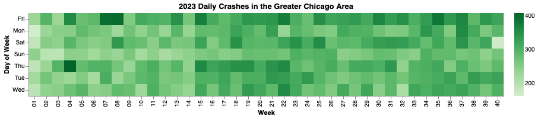

2. Stacked Area Chart

This chart uses the dates for a temporal overview of the data starting from late 2015. This displays the most severe injuries for each given day through time. It displays more precise information on hover.

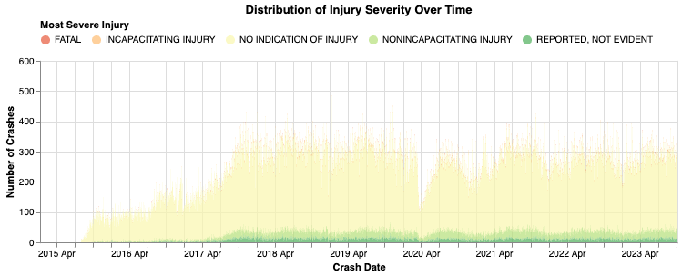

3. Double-Time Bar Graph

The "Double-Time Bar Graph" provides insights into the number of crashes that happen at each hour. It has been split into day and night representations, where each hour on the y-axis offers insights into the differences between the timeframes.

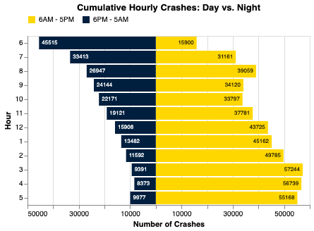

4. Stacked Bar Chart

This is a series of stacked bar charts for each condition with respect to each injury type available from the dataset. The x-axis represents the total number of injuries for the categories.

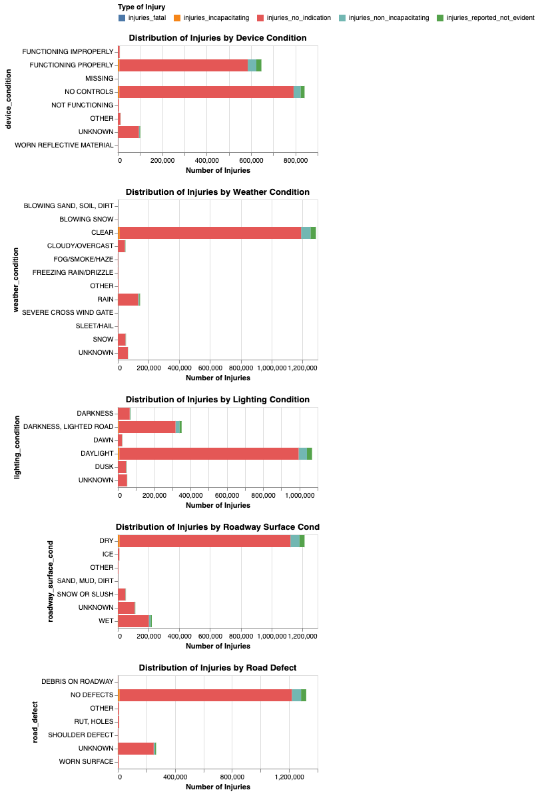

5. Heatmap

This map shows the top relationship between the top ten primary and secondary contributory causes. 

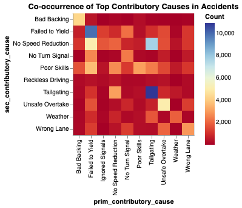

6. Scatter Plot

This scatter plot was not apart of our original visualizations. However, we opted for it as it gives insights into correlation between the average fatalies and posted speed limit. The size of the circles represent the squared number of injuries (for visibility purposes) and the damage level is either green, yellow, or red.

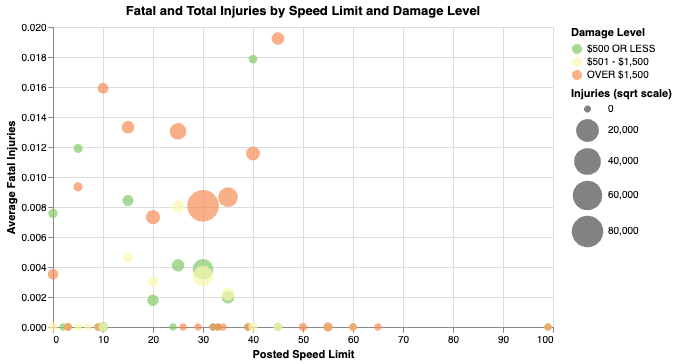

### Task 2: Spatial Visualization

1. Choropleth & Bar Graph

These two combine to provide insights into the crashes per police beat and injuries based on speed limit. By clicking on a beat, you modify the speed limits available. By clicking on a speed limit bar, you modify the beats shown with crashes for the particular speed limit. 

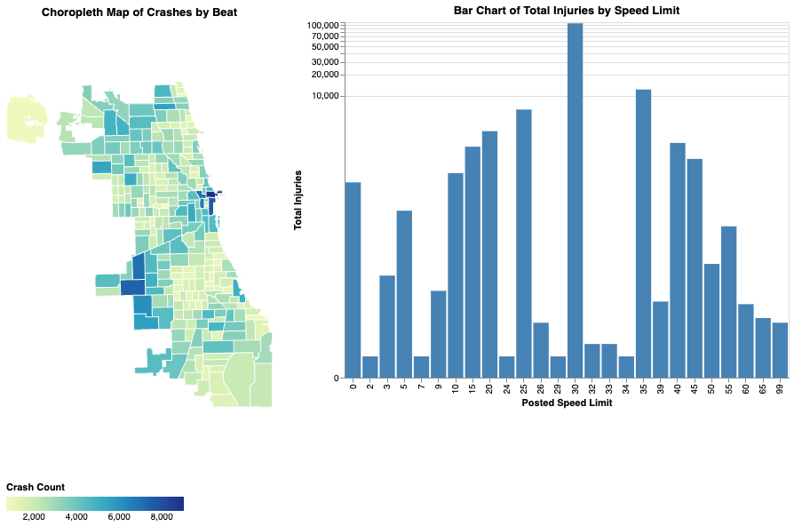

2. Heatmap & Bubble Chart

They both show the relationship between most severy injury and the primary contributory cause. By clicking on one of the marks, it modifies both displays.

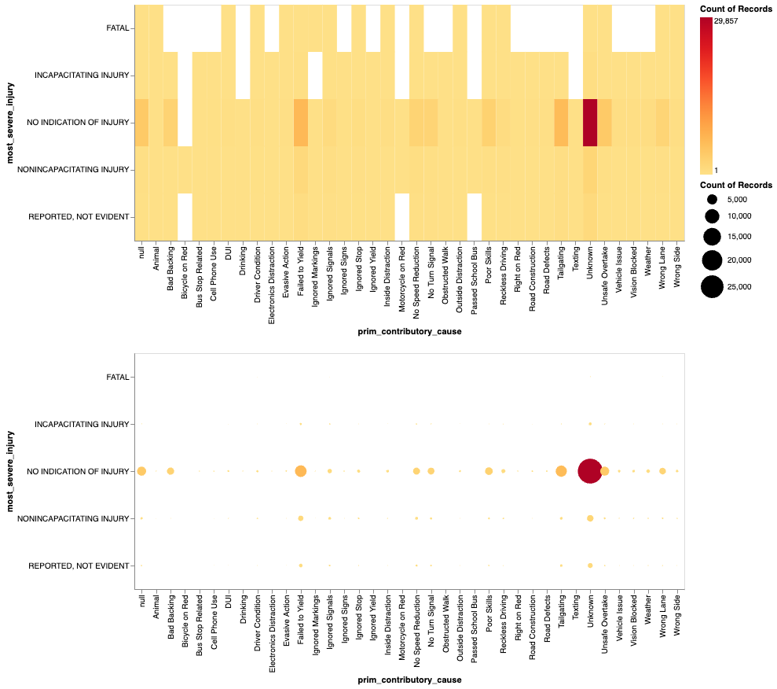

3. Parallel Coordinates Plot and Point Chart with Jittering

These graphs have linked interactions to modify both at the same time, showing insights into the day of week and crash hour. 

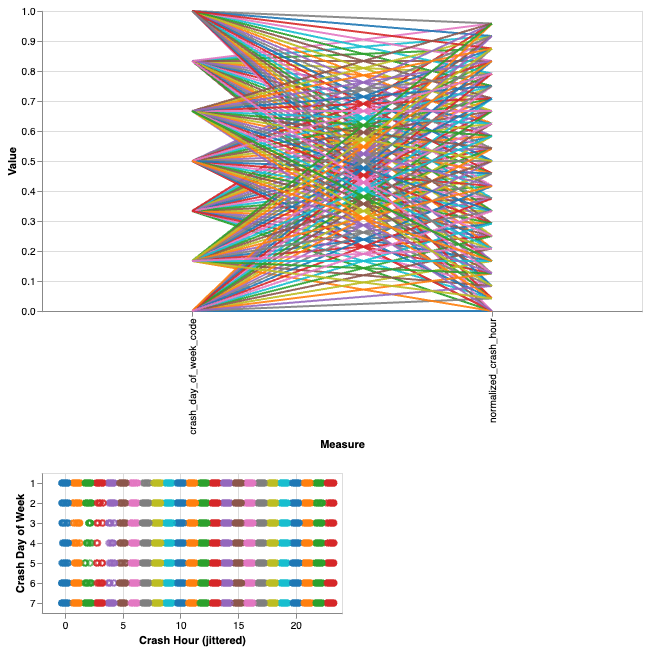

4. Donut Chart and Line Chart

The donut shows the distribution between the weather condition categories and the line chart shows the crashers over time. You can select an interval on the line chart and a single category on the weather.

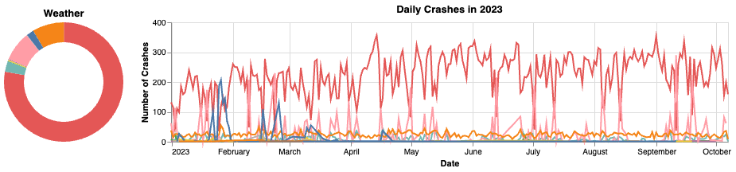

### Task 3: Spatial Visualization

This is a bubble map with dots around binned, centroid locations of the crashes throughout the city. Red means more crashes and green means less.

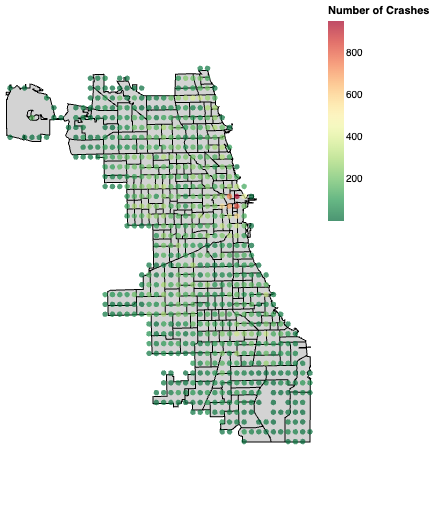