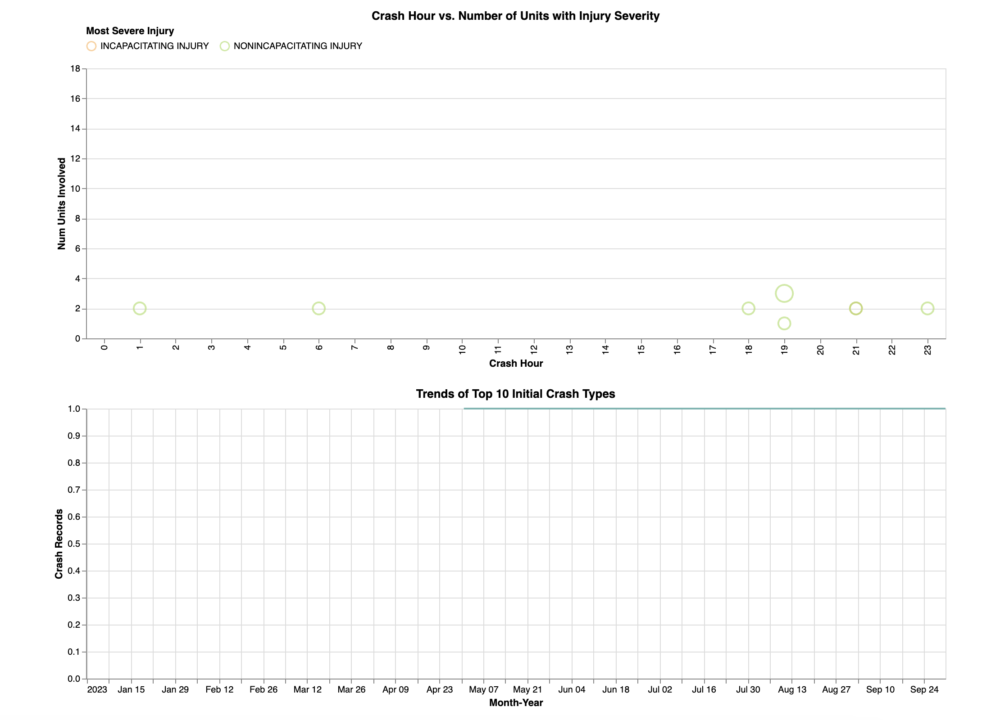

## Assignment 4

CS 424 (Fall 2023) - Visualization & Visual Analytics

Group: The Tree Friends

### Introduction

*The screenshot above is available inside the "misc" folder. A full page of the default webpage is at the end*

The public webpage can be found at [sidneymei.github.io/website-thetreefriends](https://sidneymei.github.io/website-thetreefriends). The files are the exact same as the ones found here. Please keep in mind that the webpage is not responsive due to limitations with Vega Lite. Furthermore, when shrunk the visualizations may be affected due to the use of `width: "container"`.

### Dataset Description

The "[Traffic Crashes - Crashes](https://data.cityofchicago.org/Transportation/Traffic-Crashes-Crashes/85ca-t3if)" dataset provides a comprehensive overview of traffic accidents within the city's limits. The dataset is updated regularly as finalized reports come in from the Chicago Police Department (CPD)'s electronic crash report system (E-Crash). Each record in the dataset captures specific details about an individual crash event, including the date and time of the incident, exact location, conditions (weather, lighting, and road), type and severity of the crash, the presence and state of traffic control devices, and specific injuries sustained by those involved. The dataset may be of interest to city planners, traffic safety researchers, insurance companies, and law enforcement agencies. The data can be used for a variety of purposes, such as identifying high-risk intersections, understanding the impact of weather conditions on accidents, and designing traffic safety campaigns.

### Questions

From our initial questions, we wanted to answering the following:

1. How do traffic crashes distribute over different periods, such as days, weeks, months, or even years?

1. Can we identify hotspots in the city using locational data?

1. How do different environmental and infrastructural conditions affect the likelihood of crashes?

1. Can we discern causal patterns into the severity and number of injuries in these crashes?

### Transformations

- Removal of documents with geocoordinate points outside the city boundaries to ensure correct mapping.
- Omission of the `crash_record_id` and `rd_no` as they are only relevant when working with supplementary datasets.
- Removal of features with more than 3% of documents missing to maintain the integrity and accuracy of our data. 
- Removal of remaining documents with `NaN` values as they aren't beneficial.
- Feature engineering (general and specific) for each of the four final visualizations in VegaLite.
*e.g. expansion of `crash_date` for separate access to month and year, aggregation of features using `groupby`, etc...*

### Encodings

**Calendar Heatmap**

- Marks: Area (_the squares that represent each date_)
- Channels: Positions (_their horizontal and vertical locations for the week and weekday_), Color (representation of the crash counts)

**Choropleth Map**

- Marks: Area
- Channels: Positions (_the location of the beats_), Color (representation of the crash counts), Shape (_the area that each beat takes_)

**Bar Graph**

- Marks: Lines
- Channels: Positions (_the layout of the graph_), Color & Lengths(_the injury counts_)

**Dot Plot**

- Marks: Points
- Channels: Positions (_their position with respect to the hour and units involved_), Color (_severity of injuries_), Size (_number of injuries_)

**Multiple Line Graph**

- Marks: Lines
- Channels: Positions (_the number of crashes given the month/year_), Color (_different crash types_), Size (_number of injuries_)

**Bubble Map**

- Marks: Points
- Channels: Positions (_coordinates of aggregated crashes_), Size (_number of crashes_)

### Interactions

- Generally, we have included a tooltip on hover for each of the visualizations present. Each tooltip showing unique insights with respect to data represented. 

- The **calendar heatmap** simply shows further insights into the crash date with the tooltip. Additionally, we have included hover effects altering the color to better highlight the area interacted.

*Interaction with the Calendar Heatmap*

- The **choropleth map** and **bar graph** work in unison to illustrate the relationship of crashes and the injuries caused at varying speed limits. By clicking/selecting a "beat", the user is able to focus on crashes for the area. Furthermore, a click on a bar highlights areas where crashes have occurred within the specified limit.

*Crashes in the City at Posted Speed Limit of 9*

- By selecting an area on the **dot plot**, the user modifies the domain of the associated **line graph**. We have included additional interactions using _dropdowns_ and _sliders_ to allow further filteration into specific conditions and years.

*Temporal Insights into Crashes Occuring in Wet Roads with Dark Lighting and Clear Weather*

### Initial Findings/Main Points

- The data is heavily skewed. *e.g. many crashes have little to no injuries and alot of causes is unknown*
- Varying posted speed limits don't necessarily affect the likelihood of crashes with a majority of crashes occurring at 30.
- A majority of crashes occur at hotspots such as the downtown area, which includes the Loop and Grant Park.
- Most crashes occuring the daytime and are nonincapacitating.
- A lot of crashes occur during normal conditions with clear weather and dry roads.

*Screenshot of the webpage without any modifications or interactions*